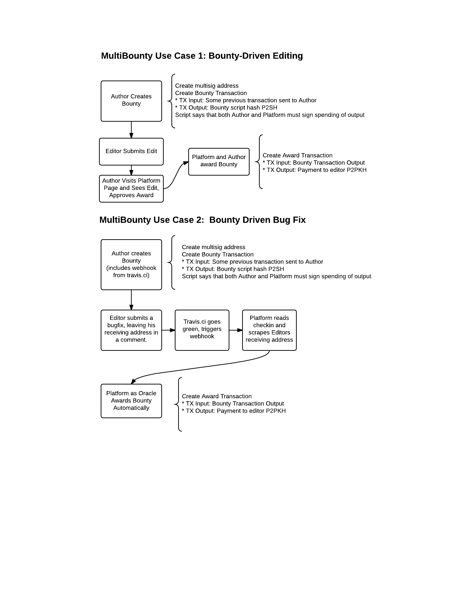

# multibounty
#MultiSig Bounty Library

Provides library and exampes that solve the following problem:

You are an author of some code or other work on github.  You want to incentivize people to do work, such as fix bugs in code, or supply excellent edits to documentation.

**Three steps need to be made:**

1) **Bounty Transaction:** You want to offer a bounty that is irrevocable, to be awarded for the work desired, to the first person to satisfy some condition.  So you make a Bounty Transaction locking up that money for that purpose.  

2) **Decision:** A decision is made as to who should win the bounty, either by You, or by the MultiBounty Platform as Oracle.  

3) **Award Transaction:** Finally, an award must be made sending the output of the Bounty Transaction to the receiving address of the winner.

Many different possibilities exist for more comple use cases and workflows.  The Bounty could be multiparty (many people chip in to the award, some number need to be in agreement to present it).  The decision can be complex, involving voting, test driven development, etc.  The Award might be given partially to many submissions that all contribute some value.

Two of the simplest workflows we imagine are included below in use cases 1 and 2.

MultiBounty was created as a blockchainu midterm project.

