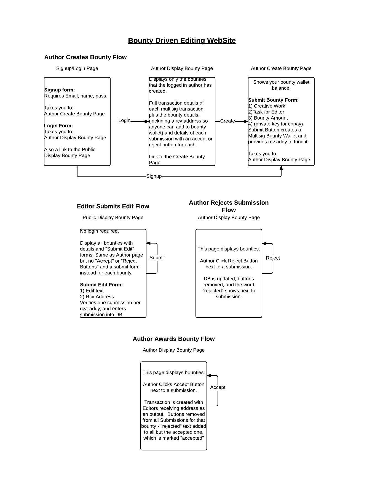

# multibounty
#MultiSig Bounty Library

Provides library and examples that use the bitcoin blockchain to solve the following problem:

You are an author of some code or other work on github.  You want to incentivize people to do work, such as fix bugs in code, or supply excellent edits to documentation.

**Three steps need to be made:**

1) **Bounty Transaction:** You want to offer a bounty that is irrevocable, to be awarded for the work desired, to the first person to satisfy some condition.  So you make a Bounty Transaction locking up that money for that purpose.  

2) **Decision:** A decision is made as to who should win the bounty, either by You, or by the MultiBounty Platform as Oracle.  

3) **Award Transaction:** Finally, an award must be made sending the output of the Bounty Transaction to the receiving address of the winner.

Two of the simplest workflows we imagine are included below in use cases 1 and 2.

I took a first pass at mocking up the simpler of those two cases, Bounty Driven Editing, as a website:

**Future Work:** Many different possibilities exist for more complex use cases and workflows.  

Looking just at the three steps required to make a bounty:

In the first step, the Bounty could be multiparty (many people chip in to the award, some number need to be in agreement to present it).  

In the second step, the Decision to award a bounty, can be complex, involving multiple parties, voting, test driven development, handoff of copyright, and more.  The bounty could also be restricted to a list of individuals (or even just to the author).

In the third  step, the award transaction might be given partially to many submissions that all contribute some value.  

Finally, the underlying services for blockchain manipulation (blockcypher, block.io, bitcore-wallet-service, ethereum, etc) and decision making (github, travis.ci) could be abstracted.  We'll just start simple, though.

There are some really fun ideas that have been proposed for bounties, and could be explored further here.  Such as:

* Security bounties - obtain a private key required to sign a transaction by cracking security of a system, revealing it.  Of course, one would want this to be verified by a few others who would sign to verify that the exploit was fully revealed to the owner of the system cracked.
* Github integration - this is a tricky one, because although a micro-format can be used in co-operation with github issues and commits to prevent one from having to leave their flow, github is a horrible sidechain, allowing modification to almost anything you add after the fact.  As far as we can tell, github.com itself would have to add some functionality to enable this to work.
* Copyright assignment might be interesting.  That could be done as a contract on one blockchain or another as well, although how legally binding that might be in any jurisdiction is a bit fuzzy.  Simple enough to apply a shrink wrap EULA when submitting an edit - but maybe you don't want to offer the copyright until you get the bounty.  Or...maybe you want to have fun writing smart contracts! ;)
* The big kahuna problem is to make it easy for end users to do this without a platform - something that would probably involve much more featureful client wallets than we have seen (proposal, signed transaction sharing, on-chain messaging..

MultiBounty was created as a blockchainu midterm project.

